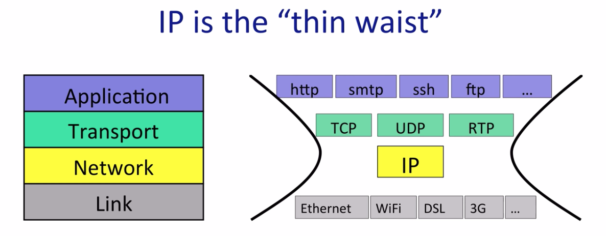

## 1. Networked Applications

Network applications can exchange data across the world.

The most common communication model used is a bidirectional, reliable stream of bytes. Here are some examples of the applications:

**Example 1: World Wide Web**

The world wide web works using something called
HTTP, which stands for the HyperText Transfer Protocol. When you see `http://` in your browser,
that means it’s communicating using HTTP.

In HTTP, a client opens a connection to a server and sends commands to it. The most common command is `GET`, which requests a page. HTTP was designed to be a document-centric way for programs to communicate.

**Example 2: BitTorrent**

BitTorrent is a program that allows people to share and exchange large files. Unlike the web, where a client requests documents from a server, in BitTorrent a client requests documents from other clients.

BitTorrent breaks files up into chunks of data called pieces. When a client downloads a complete piece from another client, it then tells other clients it has that piece so they can download it too.

When a client wants to download a file, it first has to find something called a torrent file. Usually, you find this using the world wide web and download it using HTTP.

**Example 3: Skype**

When you want to call someone on Skype, it’s a simple client-server exchange, sort of like HTTP. You, the caller, open a connection to the recipient. If the recipient accepts your call, you start exchanging voice, video, or chat data.

In some ways this looks like the world wide web example: one side opens a connection to the other and they exchange data. But unlike the web, where there’s a client and a server, in the Skype case you have two clients.

The complication comes from something called a **NAT**, or Network Address Translator. NATs are everywhere today. A small home wireless router is a NAT. When a mobile phone connects to the Internet, it’s behind a NAT. If you’re behind a NAT then you can open connections out to the Internet, but other nodes on the Internet can’t easily open connections to you.

Client A was trying to open a connection to client B, but since B was behind a NAT, it couldn’t. So instead it sends a message to a computer that client B is already connected to, which then asks client B to open a connection back to client A. Since client A isn’t behind a NAT, this connection can open normally. This is called a reverse connection because it reverses the expected direction for initiating the connection.

What does Skype do if both clients are behind NATs? We can’t reverse the connection. To handle this case, Skype introduces a second kind of server, called a `Relay`. When client A sends data, the relay forwards it to client B through the connection that B opened.

### Summary and Quiz

## 2. The 4 Layer Internet Model

The "4 Layer Internet Model" was created to describe the hierarchy of operations that make up the Internet, so that applications can reuse the same building blocks over and over again, without having to create them from scratch for every application.

Each layer has a different responsibility, with each layer building a service on top of the one below, all the way to the top where we have the bi-directional reliable byte stream communication between applications.

### 2.1. Link Layer

The Internet is made up of end-hosts, links and routers. Data is delivered hop-by-hop over each link in turn. Data is delivered in packets. A packet consists of the data we want to be delivered, along with a header that tells the network where the packet is to be delivered, where it came from and so on.

The Link Layer’s job is to carry the data over one link at a time. `Ethernet` and `WiFi` are two examples of different Link layers.

### 2.2. Network Layer

The network layer’s job is to deliver packets end-to-end across the Internet from the source to the destination.

A packet is an important basic building block in networks. A packet is the name we give to a self-contained collection of data, plus a header that describes what the data is, where it is going and where it came from. Network layer packets are called `datagrams`.

The Network hands the datagram to the Link Layer, telling it to send the datagram over the first link. In other words, the Link Layer is providing a **service** to the Network Layer. Essentially, the Link Layer says: “if you give me a datagram to send, I will transmit it over one link for you”.

At the other end of the link is a router. The Link Layer of the router accepts the datagram from the link, and hands it up to the Network Layer in the router. The Network Layer on the router examines the destination address of the datagram, and is responsible for routing the datagram one hop at a time towards its eventual destination.

If an application wants a guarantee that its data will be retransmitted when necessary and will be delivered to the application in order and without corruption then it needs another protocol running on top of IP. This is the job of the `Transport Layer`.

### 2.3. Transport Layer

The most common Transport Layer is **TCP (Tranmission Control Protocol)**. (You have probably heard of `TCP/IP`, which is when an application uses both TCP and IP together).

TCP makes sure that data sent by an application at one end of the Internet is correctly delivered to the application at the other end of the Internet. Applications such as a web client, or an email client,
find TCP very useful indeed.

If an application doesn’t need reliable delivery, it can use the much simpler UDP （user datagram protocol）instead. UDP just bundles up application data and hands it to the Network Layer for delivery to the other end.

### 2.4. Application Layer

Applications can reuse the Transport Layer by using the well-defined API from the Application Layer to the TCP or UDP service beneath. Applications have a protocol of their own that defines the syntax and semantics of data flowing between the two end points. Each layer communicates with its peer layer.

### 2.5. Summary

When the **application** has data to send, it hands the data to the **Transport layer**, which has the job of delivering the data reliably (or not) to the other end. The Transport Layer sends data to the other end by handing it to the **Network Layer**, which has the job of breaking the data into packets, each with the correct destination address. Finally, the packets are handed to the **Link Layer**, which has the responsibility of delivering the packet from one hop to the next along its path.

### Quiz

## 3. The IP Service Model

### 3.1. How IP Works

We are going to focus on the **Network Layer**. This is the most important layer of the Internet. Whenever we use the Internet we are required to use the Internet Protocol to send and receive packets.

When the transport layer has data to send, it hands a `Transport Segment` to the Network layer below. The network layer puts the transport segment inside a new IP datagram. IP’s job is to deliver the datagram to the other end.

IP sends the datagram to the Link Layer that puts it inside a Link frame, such as an Ethernet packet and ships it off to the first router.

### 3.2. The IP Service Model

Datagrams are routed hop-by-hop through the network from one router to the next, all the way from the IP source address to the IP destination address. The router doesn’t know the whole path – it simply uses the destination address to index into its forwarding table so that it can forward the packet to the next hop along the path towards its final destination.

IP is unreliable. IP makes no promise that packets will be delivered to the destination.

In fact, the IP datagram service is very much like the basic postal service. IP is an extremely simple, minimal service. It maintains no state at all related to a communication. We say that a communication service is `connectionless` because it doesn’t start by establishing some end to state associated with the communication. The IP layer simply routes each datagram individually and independently
of all the others.

In addition to the basic unreliable, best-effort, connectionless datagram service, IP also provides
a few other carefully chosen services. Here are 5 features:

### Summary & Quiz

* IP is important. We use it every time we send and receive packets in the Internet.
* It is a simple, dumb, minimal service with four main features:
  * Datagram: It sends datagrams, hop-by-hop across the Internet
  * Unreliable
  * Best-effort
  * Connectionless: there is no per-flow state making the protocol connectionless

